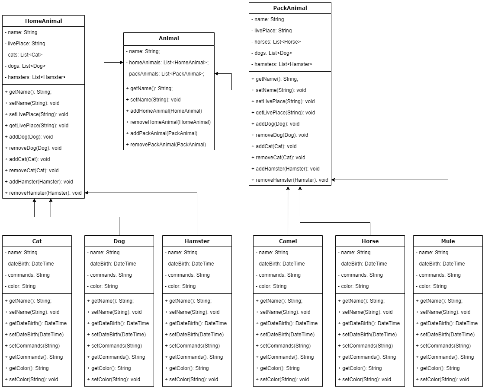
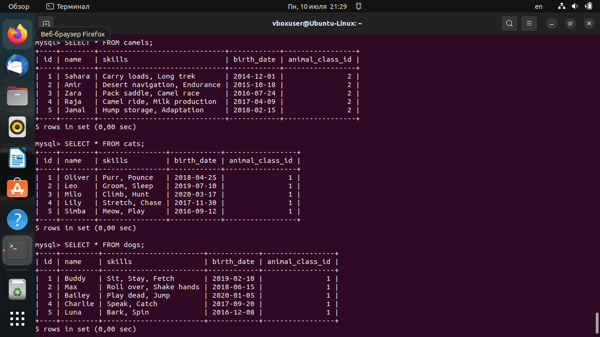

# Итоговая аттестация

### Организуйте систему учёта для питомника, в котором живут домашние и вьючные животные.

1. Используя команду cat в терминале операционной системы Linux, создать два файла
   Домашние животные (заполнив файл собаками, кошками, хомяками) и Вьючные животными
   заполнив файл Лошадьми, верблюдами и ослы), а затем объединить их.
    ```shell
        $ cat > pets.txt
        $ cat > pack_animals.txt
        $ cat pets.txt pack_animals.txt > all_animals.txt
    ```


Просмотреть содержимое созданного файла. Переименовать файл, дав ему новое имя (Друзья человека).
```shell
      $ cat all_animals.txt
      $ mv all_animals.txt human_friends.txt
```


2. Создать директорию, переместить файл туда

```shell
      $ mkdir animals
      $ mv human_friends.txt animals/
```


3. Подключить дополнительный репозиторий MySQL. Установить любой пакет
   из этого репозитория.
```shell
      $ wget https://dev.mysql.com/get/mysql-apt-config_0.8.18-1_all.deb
      $ sudo dpkg -i mysql-apt-config_0.8.18-1_all.deb
```


```shell
      $ sudo apt update 
      $ sudo apt install mysql-server mysql-client
      $ systemctl status mysql.service
```


4. Установить и удалить deb-пакет с помощью dpkg.

```shell
   $ wget http://ftp.us.debian.org/debian/pool/main/s/sl/sl_5.02-1_amd64.deb
   $ sudo dpkg -i sl_5.02-1_amd64.deb
   $ sudo dpkg -r sl
```


5. Выложить историю команд в терминале ubuntu
```shell
   $ history
```


6. Нарисовать диаграмму, в которой есть класс родительский класс, домашние
животные и вьючные животные, в составы которых в случае домашних
животных войдут классы: собаки, кошки, хомяки, а в класс вьючные животные
войдут: Лошади, верблюды и ослы).




7. В подключенном MySQL репозитории создать базу данных “Друзья
человека”
```shell
   -- Создаем базу данных "human_friends"
      CREATE DATABASE IF NOT EXISTS `human_friends`;
```

8. Создать таблицы с иерархией из диаграммы в БД
```shell
   -- Используем созданную базу данных
      USE `human_friends`;
   -- Создаем таблицу "animals"
      CREATE TABLE `animals` (
      id INT UNSIGNED NOT NULL AUTO_INCREMENT PRIMARY KEY UNIQUE,
      animals_class VARCHAR(30)
      );

   -- Создаем таблицу "dogs" с внешним ключом на таблицу "animals"
      CREATE TABLE `dogs` (
      id INT UNSIGNED NOT NULL AUTO_INCREMENT UNIQUE,
      `name` VARCHAR(50) NOT NULL,
      `skills` VARCHAR(100) NOT NULL,
      `birth_date` DATE NOT NULL,
      `animal_class_id` INT UNSIGNED NOT NULL,
      FOREIGN KEY (`animal_class_id`) REFERENCES `animals` (`id`) ON DELETE CASCADE
      );

   -- Создаем таблицу "cats" с внешним ключом на таблицу "animals"
      CREATE TABLE `cats` (
      id INT UNSIGNED NOT NULL AUTO_INCREMENT UNIQUE,
      `name` VARCHAR(50) NOT NULL,
      `skills` VARCHAR(100) NOT NULL,
      `birth_date` DATE NOT NULL,
      `animal_class_id` INT UNSIGNED NOT NULL,
      FOREIGN KEY (`animal_class_id`) REFERENCES `animals` (`id`) ON DELETE CASCADE
      );

   -- Создаем таблицу "hamsters" с внешним ключом на таблицу "animals"
      CREATE TABLE `hamsters` (
      id INT UNSIGNED NOT NULL AUTO_INCREMENT UNIQUE,
      `name` VARCHAR(50) NOT NULL,
      `skills` VARCHAR(100) NOT NULL,
      `birth_date` DATE NOT NULL,
      `animal_class_id` INT UNSIGNED NOT NULL,
      FOREIGN KEY (`animal_class_id`) REFERENCES `animals` (`id`) ON DELETE CASCADE
      );

    -- Создаем таблицу "horses" с внешним ключом на таблицу "animals"
      CREATE TABLE `horses` (
      id INT UNSIGNED NOT NULL AUTO_INCREMENT UNIQUE,
      `name` VARCHAR(50) NOT NULL,
      `skills` VARCHAR(100) NOT NULL,
      `birth_date` DATE NOT NULL,
      `animal_class_id` INT UNSIGNED NOT NULL,
      FOREIGN KEY (`animal_class_id`) REFERENCES `animals` (`id`) ON DELETE CASCADE
      );

   -- Создаем таблицу "camels" с внешним ключом на таблицу "animals"
      CREATE TABLE `camels` (
      id INT UNSIGNED NOT NULL AUTO_INCREMENT UNIQUE,
      `name` VARCHAR(50) NOT NULL,
      `skills` VARCHAR(100) NOT NULL,
      `birth_date` DATE NOT NULL,
      `animal_class_id` INT UNSIGNED NOT NULL,
      FOREIGN KEY (`animal_class_id`) REFERENCES `animals` (`id`) ON DELETE CASCADE
      );

   -- Создаем таблицу "donkeys" с внешним ключом на таблицу "animals"
      CREATE TABLE `donkeys` (
      id INT UNSIGNED NOT NULL AUTO_INCREMENT UNIQUE,
      `name` VARCHAR(50) NOT NULL,
      `skills` VARCHAR(100) NOT NULL,
      `birth_date` DATE NOT NULL,
      `animal_class_id` INT UNSIGNED NOT NULL,
      FOREIGN KEY (`animal_class_id`) REFERENCES `animals` (`id`) ON DELETE CASCADE
      );
   ```


9. Заполнить низкоуровневые таблицы именами(животных), командами
   которые они выполняют и датами рождения
```shell
   -- Заполняем таблицу "animals"
   INSERT INTO `human_friends`.`animals` (`id`, `animals_class`) VALUES ('1', 'pet'),('2', 'wild');

   -- Заполняем таблицу "dogs"
   INSERT INTO `human_friends`.`dogs` (`name`, `skills`, `birth_date`, `animal_class_id`) VALUES
   ('Buddy', 'Sit, Stay, Fetch', '2019-02-10', 1),
   ('Max', 'Roll over, Shake hands', '2018-06-15', 1),
   ('Bailey', 'Play dead, Jump', '2020-01-05', 1),
   ('Charlie', 'Speak, Catch', '2017-09-20', 1),
   ('Luna', 'Bark, Spin', '2016-12-08', 1);

   -- Заполняем таблицу "cats"
   INSERT INTO `human_friends`.`cats` (`name`, `skills`, `birth_date`, `animal_class_id`) VALUES
   ('Oliver', 'Purr, Pounce', '2018-04-25', 1),
   ('Leo', 'Groom, Sleep', '2019-07-10', 1),
   ('Milo', 'Climb, Hunt', '2020-03-17', 1),
   ('Lily', 'Stretch, Chase', '2017-11-30', 1),
   ('Simba', 'Meow, Play', '2016-09-12', 1);

   -- Заполняем таблицу "hamsters"
   INSERT INTO `human_friends`.`hamsters` (`name`, `skills`, `birth_date`, `animal_class_id`) VALUES
   ('Coco', 'Run on the wheel', '2021-01-03', 1),
   ('Peanut', 'Hide food, Burrow', '2022-02-14', 1),
   ('Oreo', 'Climb tubes', '2020-11-20', 1),
   ('Biscuit', 'Cheek pouches, Dig', '2019-10-05', 1),
   ('Hazel', 'Gnaw, Explore', '2023-04-01', 1);

   -- Заполняем таблицу "horses"
   INSERT INTO `human_friends`.`horses` (`name`, `skills`, `birth_date`, `animal_class_id`) VALUES
   ('Spirit', 'Gallop, Jump', '2015-08-20', 2),
   ('Daisy', 'Trot, Lunge', '2016-06-10', 2),
   ('Apollo', 'Dressage, Canter', '2017-03-15', 2),
   ('Willow', 'Trail riding, Vaulting', '2018-11-25', 2),
   ('Rocky', 'Western riding, Reining', '2019-09-05', 2);

   -- Заполняем таблицу "camels"
   INSERT INTO `human_friends`.`camels` (`name`, `skills`, `birth_date`, `animal_class_id`) VALUES
   ('Sahara', 'Carry loads, Long trek', '2014-12-01', 2),
   ('Amir', 'Desert navigation, Endurance', '2015-10-18', 2),
   ('Zara', 'Pack saddle, Camel race', '2016-07-24', 2),
   ('Raja', 'Camel ride, Milk production', '2017-04-09', 2),
   ('Jamal', 'Hump storage, Adaptation', '2018-02-15', 2);

   -- Заполняем таблицу "donkeys"
   INSERT INTO `human_friends`.`donkeys` (`name`, `skills`, `birth_date`, `animal_class_id`) VALUES
   ('Jack', 'Carry load, Braying', '2019-08-12', 2),
   ('Jenny', 'Grazing, Guarding', '2020-05-05', 2),
   ('Molly', 'Plowing, Companion', '2021-02-20', 2),
   ('Oscar', 'Stubbornness, Towing', '2022-09-10', 2),
   ('Rosie', 'Trick training, Therapy', '2023-06-05', 2);
```





10. Удалить из таблицы верблюдов, т.к. верблюдов решили перевезти в другой
    питомник на зимовку.
    Объединить таблицы лошади, и ослы в одну таблицу.
```shell
  
   -- Удалить таблицу "camels"
   DROP TABLE `human_friends`.`camels`;

   -- Объединить таблицы "horses", и "donkeys" в одну таблицу
   -- Создаем новую таблицу "horses_and_donkeys" для объединения "horses" и "donkeys"
   CREATE TABLE `horses_and_donkeys` (
   id INT UNSIGNED NOT NULL AUTO_INCREMENT UNIQUE,
   `name` VARCHAR(50) NOT NULL,
   `skills` VARCHAR(100) NOT NULL,
   `birth_date` DATE NOT NULL,
   `animal_class_id` INT UNSIGNED NOT NULL,
   `species` VARCHAR(10) NOT NULL,
   PRIMARY KEY (`id`)
   );

   -- Вставляем данные из "horses" в таблицу "horses_and_donkeys"
   INSERT INTO `horses_and_donkeys` (`name`, `skills`, `birth_date`, `animal_class_id`, `species`)
   SELECT `name`, `skills`, `birth_date`, `animal_class_id`, 'Horse' AS `species`
   FROM `horses`;

   -- Вставляем данные из "donkeys" в таблицу "horses_and_donkeys"
   INSERT INTO `horses_and_donkeys` (`name`, `skills`, `birth_date`, `animal_class_id`, `species`)
   SELECT `name`, `skills`, `birth_date`, `animal_class_id`, 'Donkey' AS `species`
   FROM `donkeys`;
```


11. Создать новую таблицу “молодые животные” в которую попадут все
    животные старше 1 года, но младше 3 лет и в отдельном столбце с точностью
    до месяца подсчитать возраст животных в новой таблице
 ```shell
-- Создаем новую таблицу "young_animals"
CREATE TABLE `young_animals` (
id INT UNSIGNED NOT NULL AUTO_INCREMENT PRIMARY KEY,
`name` VARCHAR(50) NOT NULL,
`species` VARCHAR(20) NOT NULL,
`age_months` INT NOT NULL
);

-- Вставляем данные из таблиц `dogs`, `cats`, `donkeys`, `hamsters`, и `horses` в таблицу `young_animals`
INSERT INTO `young_animals` (`name`, `species`, `age_months`)
SELECT `name`, 'Dog' AS `species`, TIMESTAMPDIFF(MONTH, `birth_date`, CURDATE()) AS `age_months`
FROM `dogs`
WHERE `birth_date` <= DATE_SUB(CURDATE(), INTERVAL 1 YEAR) AND `birth_date` >= DATE_SUB(CURDATE(), INTERVAL 3 YEAR);

INSERT INTO `young_animals` (`name`, `species`, `age_months`)
SELECT `name`, 'Cat' AS `species`, TIMESTAMPDIFF(MONTH, `birth_date`, CURDATE()) AS `age_months`
FROM `cats`
WHERE `birth_date` <= DATE_SUB(CURDATE(), INTERVAL 1 YEAR) AND `birth_date` >= DATE_SUB(CURDATE(), INTERVAL 3 YEAR);

INSERT INTO `young_animals` (`name`, `species`, `age_months`)
SELECT `name`, 'Donkey' AS `species`, TIMESTAMPDIFF(MONTH, `birth_date`, CURDATE()) AS `age_months`
FROM `donkeys`
WHERE `birth_date` <= DATE_SUB(CURDATE(), INTERVAL 1 YEAR) AND `birth_date` >= DATE_SUB(CURDATE(), INTERVAL 3 YEAR);

INSERT INTO `young_animals` (`name`, `species`, `age_months`)
SELECT `name`, 'Hamster' AS `species`, TIMESTAMPDIFF(MONTH, `birth_date`, CURDATE()) AS `age_months`
FROM `hamsters`
WHERE `birth_date` <= DATE_SUB(CURDATE(), INTERVAL 1 YEAR) AND `birth_date` >= DATE_SUB(CURDATE(), INTERVAL 3 YEAR);

INSERT INTO `young_animals` (`name`, `species`, `age_months`)
SELECT `name`, 'Horse' AS `species`, TIMESTAMPDIFF(MONTH, `birth_date`, CURDATE()) AS `age_months`
FROM `horses`
WHERE `birth_date` <= DATE_SUB(CURDATE(), INTERVAL 1 YEAR) AND `birth_date` >= DATE_SUB(CURDATE(), INTERVAL 3 YEAR);
```


12. Объединить все таблицы в одну, при этом сохраняя поля, указывающие на
    прошлую принадлежность к старым таблицам.
```shell
-- Создаем новую таблицу "all_animals"
CREATE TABLE `all_animals` (
id INT UNSIGNED NOT NULL AUTO_INCREMENT UNIQUE,
`name` VARCHAR(50) NOT NULL,
`skills` VARCHAR(100) NOT NULL,
`birth_date` DATE NOT NULL,
`animal_class_id` INT UNSIGNED NOT NULL,
`source_table` VARCHAR(20) NOT NULL,
PRIMARY KEY (`id`)
);

-- Вставляем данные из таблиц `dogs`, `cats`, `donkeys`, `hamsters`, и `horses` в таблицу `all_animals`
INSERT INTO `all_animals` (`name`, `skills`, `birth_date`, `animal_class_id`, `source_table`)
SELECT `name`, `skills`, `birth_date`, `animal_class_id`, 'dogs' AS `source_table`
FROM `dogs`;

INSERT INTO `all_animals` (`name`, `skills`, `birth_date`, `animal_class_id`, `source_table`)
SELECT `name`, `skills`, `birth_date`, `animal_class_id`, 'cats' AS `source_table`
FROM `cats`;

INSERT INTO `all_animals` (`name`, `skills`, `birth_date`, `animal_class_id`, `source_table`)
SELECT `name`, `skills`, `birth_date`, `animal_class_id`, 'donkeys' AS `source_table`
FROM `donkeys`;

INSERT INTO `all_animals` (`name`, `skills`, `birth_date`, `animal_class_id`, `source_table`)
SELECT `name`, `skills`, `birth_date`, `animal_class_id`, 'hamsters' AS `source_table`
FROM `hamsters`;

INSERT INTO `all_animals` (`name`, `skills`, `birth_date`, `animal_class_id`, `source_table`)
SELECT `name`, `skills`, `birth_date`, `animal_class_id`, 'horses' AS `source_table`
FROM `horses`;
```


#### 13-15. Программная реализация

Скриншоты выполнения


##### Подготовил студент Geek Brains Рогачев Игорь, Программирование | 8 | 3681 | 19.11.2022

